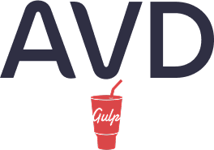

# Шаблон для быстрого старта проектов

- [Как начать новый проект?](readme/how-to-start-project.md)
- [Структура файлов проекта](readme/structure.md)
- [Установка и запуск проекта](readme/install-and-start.md)
- [Как работать в проекте](readme/how-to-work.md)
- [Правила при верстки письма](readme/email-rules.md)
- [Чек-лист для сдачи верстки](readme/check-list.md)
